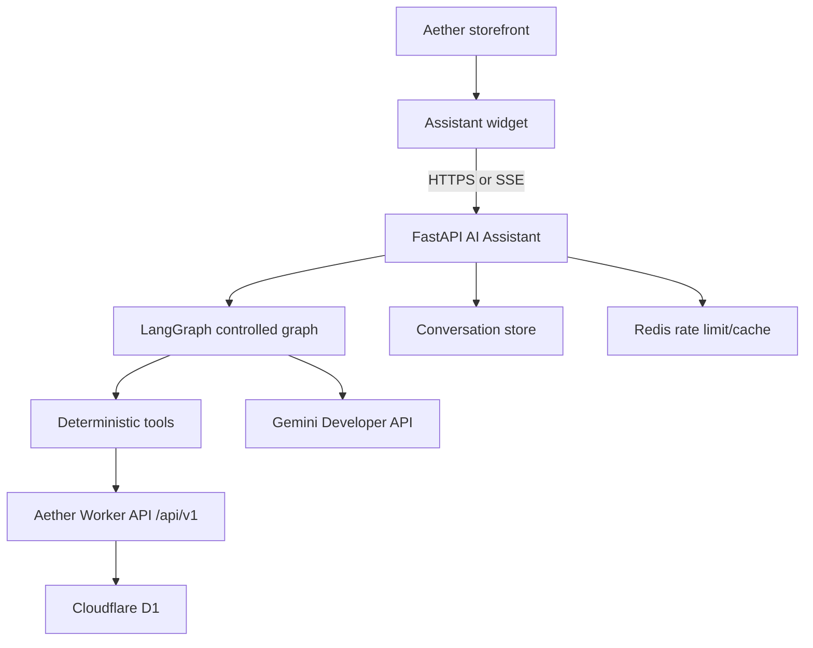
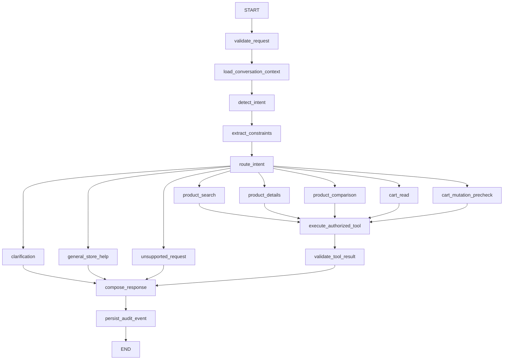

# Aether AI Assistant Architecture

## Runtime

The assistant is a separate Python service in `apps/ai-assistant`. It does not replace the Cloudflare Worker API. All commercial actions go through Aether internal HTTP endpoints.

Authentication follows the same trust boundary as the store API. The assistant forwards `Authorization` to Aether `/api/v1/me`, lets the Worker validate Clerk/JWKS, and persists only hashed user identity. It never accepts `user_id` from the message body.

## Graph

## Configuration

Key variables:

- `AI_DEPLOYMENT_ENVIRONMENT`
- `AETHER_API_BASE_URL`
- `GEMINI_API_KEY`
- `GEMINI_MODEL`
- `GEMINI_FALLBACK_MODEL`
- `GEMINI_TEMPERATURE`
- `GEMINI_MAX_OUTPUT_TOKENS`
- `AI_ASSISTANT_ENABLED`
- `AI_MUTATIONS_ENABLED`
- `AI_MAX_GRAPH_STEPS`
- `AI_MAX_LLM_CALLS_PER_REQUEST`
- `AI_MAX_TOOL_CALLS_PER_REQUEST`
- `AI_MAX_PRODUCTS_PER_RESPONSE`
- `AI_REDACT_PII`
- `AI_STORE_CONVERSATIONS`
- `AI_CATALOG_CACHE_TTL_SECONDS`
- `AI_MAX_CONCURRENT_REQUESTS`
- `DATABASE_URL`
- `REDIS_URL`

If `DATABASE_URL` starts with `postgresql://` or `postgres://`, the assistant uses PostgreSQL for conversations, messages and audit records. If it starts with `sqlite:///`, it uses SQLite for local development. Empty `DATABASE_URL` uses in-memory storage only for demos.

If `REDIS_URL` is configured, rate limiting uses Redis counters across project, IP, session and principal scopes. Otherwise it uses in-memory counters suitable only for local development.

The same Redis connection coordinates `AI_MAX_CONCURRENT_REQUESTS` across replicas. Local development uses a per-process in-memory concurrency guard.

Catalog search and product detail calls are cached briefly in memory by `AI_CATALOG_CACHE_TTL_SECONDS` to reduce repeated Aether API calls during active conversations. This cache stores only product read responses. Cart reads, cart mutations, actor lookup and authorization-sensitive requests always call the Worker API directly.

When `GEMINI_API_KEY` is configured, the graph uses Gemini for structured intent classification. If Gemini is unavailable, invalid, or over quota, the graph falls back to deterministic heuristics and keeps the store usable.

## Conversation Compaction

The assistant does not resend the full conversation or the full catalog on each request. It stores a compact `context_summary` in assistant message payloads with the active recent product references needed for follow-up commands such as "add the second one". The graph loads a small bounded context window and resolves references only against stored product IDs and URLs.

If `AI_STORE_CONVERSATIONS=false`, the graph skips conversation and message persistence entirely. The assistant still returns a stable `thread_id` for the response and still audits mutable cart attempts, but follow-up references such as "add the second one" cannot be resolved from previous turns because no recent product context is stored.

## Observability

The service emits JSON logs, Prometheus metrics at `/metrics`, and optional OTLP traces. Starter operational artifacts live in `docs/ai-assistant/observability/`:

- `prometheus-alerts.yml`
- `grafana-dashboard.json`
