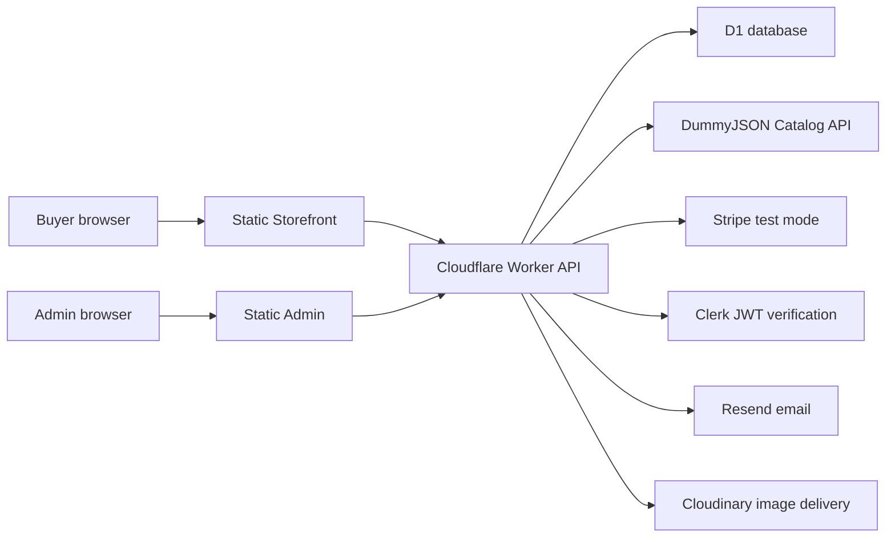

# Architecture

Aether separates all dynamic commerce behavior from the static user interfaces.

## Principles

- Static frontends only: no Next API routes, no Server Actions, no SSR dependency.
- Worker-owned trust boundary: prices, discounts, stock, order totals, refunds,
  webhooks, role checks, and emails are calculated or verified in the Worker.
- Integer cents: every monetary value is stored and exchanged as integer cents.
- External catalog data is untrusted: DummyJSON products are validated, normalized,
  cleaned, cached, and merged with local overrides before reaching the UI.
- Public demo admin cannot mutate persistent data.

## Runtime boundaries

| Surface | Runtime | Responsibility |
| --- | --- | --- |
| `apps/storefront` | Static Next export | Shopping, search, cart, account, docs |
| `apps/admin` | Static Next export | Private admin and public demo admin |
| `apps/api` | Cloudflare Worker | API, D1, auth, RBAC, checkout, email |
| `packages/schemas` | Shared TS/Zod | Contracts and validation |
| `packages/core` | Shared TS | Pure business rules and testable logic |
| `packages/api-client` | Shared TS | Typed fetch client |

## Data flow

1. Storefront requests products from `/api/v1/catalog/products`.
2. Worker loads cache, fetches DummyJSON when needed, normalizes products, applies
   overrides and inventory, and returns Aether contracts.
3. Cart and checkout requests are recalculated in the Worker.
4. Stripe Checkout sessions are created in test mode only.
5. Stripe webhooks are signature-checked, idempotent, and update orders.
6. Resend email events are logged in D1 for observability.
